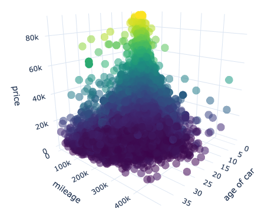
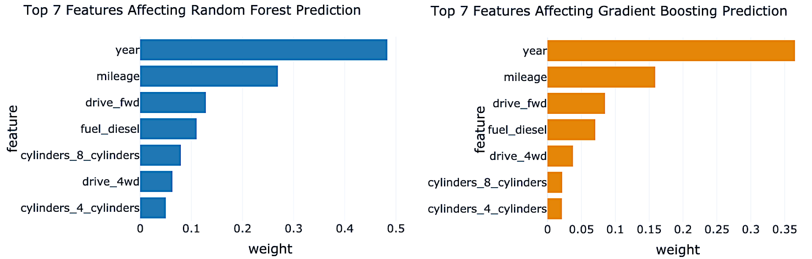
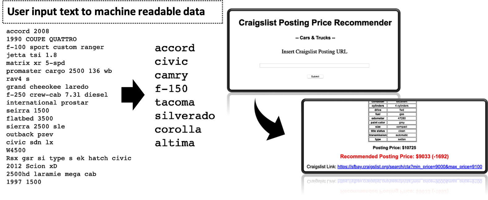

# How much is this car worth?
## Craigslist Posting Price Recommender

**Objective: Providing a guideline for both car sellers and buyers on Craigslist.**
> Posting price is the point where the negotiation starts. If you don’t have much experience regarding used-car market, setting this price is very difficult and time-consuming step.  

## Why do we want to predict used car price?
When you are planning to buy a new car, first thing you do is web searching. Gather the information and ‘estimates’ the car price you are willing to buy. Probably your estimated market price of the car is near the mean value of information you collected. In statistical term, you just set your expected value as a mean value from your sample data set. This is a good starting point, but you still need something to improve your estimation. 

Modeling is about improving your method to reach better prediction from the original estimation. Incorporating the modeling in your decision, you might able to save or earn few hundreds to thousand dollars by knowing correctly estimated car values.

## DATA
0.2 million Craigslist postings are collected over 29 cities in California, during June and July 2019 using web scrapping technique.  Data contains basic vehicle information such as company, model, year made, and paint colors based on the user input. Exploratory Data Analysis (EDA) shows car price is strongly dependent on the year and mileage information, but other features were also affecting the price of car.

## Machine Learning Models
Random Forest and Gradient Boosting models were used to provide the recommended price of the vehicle, and the important features affecting the results were analyzed. Besides year and mileage of vehicle, drive and fuel types were also important feature to result accurate prediction.  Each model achieved above 55% of error reduction compare to the base model (median), and the model is deployed to web app.

## Web APP
User-Friendly web app is developed, which immediately provides recommended price of the vehicle. When user inputs Craigslist posting URL, web-app collects the text information from the target posting. Collected information is converted to machine readable data and used for the prediction of price. The result page contains basic information of the original Craigslist posting including URL, and recommended price predicted by the model. In addition, web app also provides the clickable URL link that redirects to the Craigslist car listing page, which are similar to the recommended price.

