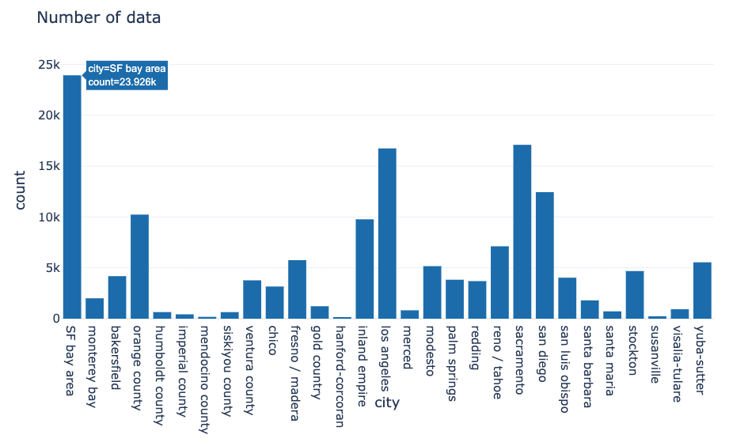

# How much is this car worth?
## Craigslist Posting Price Recommender

__*Web App Link: [Craigslist Posting Price Recommender](http://3.209.34.102:8080/)*__ 

**Objective: Providing a guideline for both car sellers and buyers on Craigslist.**
> Posting price is the point where the negotiation starts. If you don’t have much experience regarding used-car market, setting this price is very difficult and time-consuming step.  

## Why do we want to predict used car price?
When you are planning to buy a new car, first thing you do is web searching. Gather the information and ‘estimates’ the car price you are willing to buy. Probably your estimated market price of the car is near the mean value of information you collected. In statistical term, you just set your expected value as a mean value from your sample data set. This is a good starting point, but you still need something to improve your estimation. 

Modeling is about improving your method to reach better prediction from the original estimation. Incorporating the modeling in your decision, you might able to save or earn few hundreds to thousand dollars by knowing correctly estimated car values.

## DATA
0.2 million Craigslist postings are collected over 29 cities in California, during June and July 2019 using web scrapping technique. Number of collected postings vary depending on the city, but the distribution of car price were similar.

<p align="center">

</p>
<p align="center">

</p>

Data contains basic vehicle information such as company, model, year made, and paint colors based on the user input. 

```Python
raw_df=pd.read_csv('data/car_data.csv')
raw_df.info()
```

    <class 'pandas.core.frame.DataFrame'>
    RangeIndex: 237347 entries, 0 to 237346
    Data columns (total 16 columns):
    url             237347 non-null object
    city            237347 non-null object
    price           237347 non-null int64
    year            236994 non-null float64
    company         223550 non-null object
    model           231221 non-null object
    condition       130062 non-null object
    cylinders       139521 non-null object
    fuel            236520 non-null object
    mileage         191022 non-null float64
    title_status    236114 non-null object
    transmission    235256 non-null object
    drive           164950 non-null object
    size            77199 non-null object
    type            176577 non-null object
    paint_color     161160 non-null object
    dtypes: float64(2), int64(1), object(13)
    memory usage: 29.0+ MB

Exploratory Data Analysis (EDA) shows car price is strongly dependent on the year and mileage information. It is straight forward that the recently made cars and low milage cars are the high price cars.

<p align="center">

</p>
<p align="center">

</p>

Other features were also affecting the price of car. For example, the range of car price varies depending on the drive type. The graph shows 4WD type cars have the widest range of car price. 

<p align="center">

</p>

## Machine Learning Models
Random Forest and Gradient Boosting models were used to provide the recommended price of the vehicle, and the important features affecting the results were analyzed based on permutation importance and mean decrease in impurity. Besides year and mileage of vehicle, drive and fuel types were also important feature to result accurate prediction. 

<p align="center">

</p>
<p align="center">

</p>

Each model achieved above 55% of error reduction (MSE) compare to the base model (median), and the model is deployed to web app. For the web-app production, model file size and response time were also considered, which is important factor for the server cost and user experience. 

<p align="center">

</p>

## Web APP
User-Friendly web app is developed, which immediately provides recommended price of the vehicle. When user inputs Craigslist posting URL, web-app collects the text information from the target posting. Collected information is converted to machine readable data and used for the prediction of price. 

```Python
def content_extract(url):
    #Extrating informations from URL posting
    r = requests.get(url)
    soup = BeautifulSoup(r.content, "html")
    
    #title, year, posting price and image URL
    title = soup.title.text.strip()

    year = int(title[:4])
    
    title_txt = soup.find("span", {"class": "postingtitletext"})
    price = title_txt.find_all("span")
    price = price[1].text.strip()
    price = int(price.replace('$',''))
    
    image_data = soup.find("div", {"class": "slide first visible"})
    image = image_data.find_all("img")
    image_url = str(image[0]).split()[2].replace('src="', "").replace('"',"")
    
    # car spec to extraction - list
    spec_div = soup.find("div", {"class": "mapAndAttrs"})
    spec_row = spec_div.find_all("span")
    spec_raw = [str(i) for i in spec_row]
    if len(spec_raw)>12:
        spec_raw = spec_raw[:12]
    
    spec_list = [i.replace('<span>', '').replace('</span>', '')\
                .replace('<b>', '').replace('</b>', '') for i in spec_raw]
    spec_list[0] = 'model: ' + spec_list[0]
    spec_coord = [i.split(': ') for i in spec_list]
    
    #Data Frame for the display on web page
    display_dict={}
    for i,k in spec_coord:
        display_dict[i] = [k]
    display_df = pd.DataFrame.from_dict(display_dict).T 
    display_df.columns = ['Posting Information']   
    
    #Data Frame for model prediction
    spec_dict={}
    for i,k in spec_coord:
        spec_dict[i.replace(' ','_')] = [k.replace(' ','_')]
    raw_df = pd.DataFrame.from_dict(spec_dict)
    
    return title, year, price, image_url, display_df, raw_df
```


The result page contains basic information of the original Craigslist posting including URL, and recommended price predicted by the model. In addition, web app also provides the clickable URL link that redirects to the Craigslist car listing page, which are similar to the recommended price.

__*Web App Link: [Craigslist Posting Price Recommender](http://3.209.34.102:8080/)*__ 

<p align="center">

</p>

